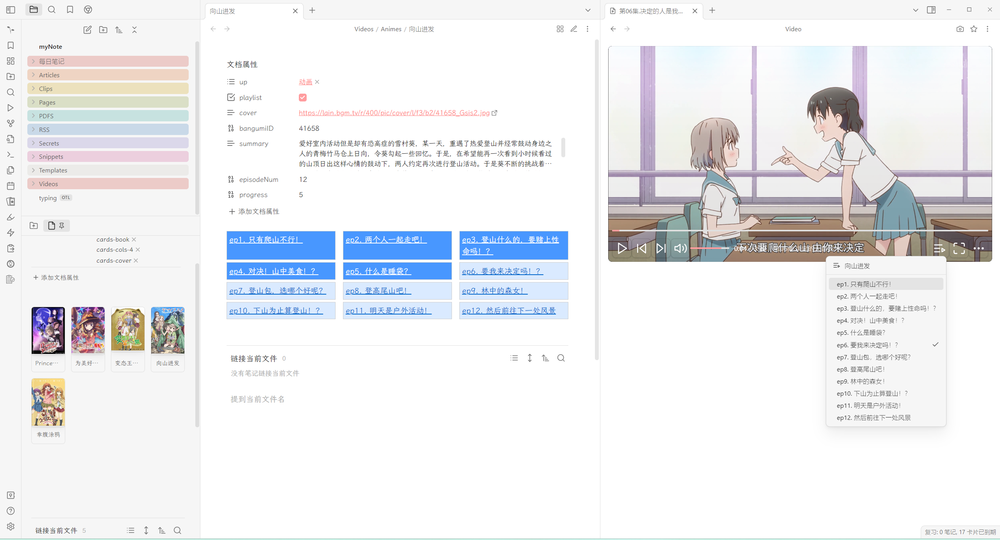
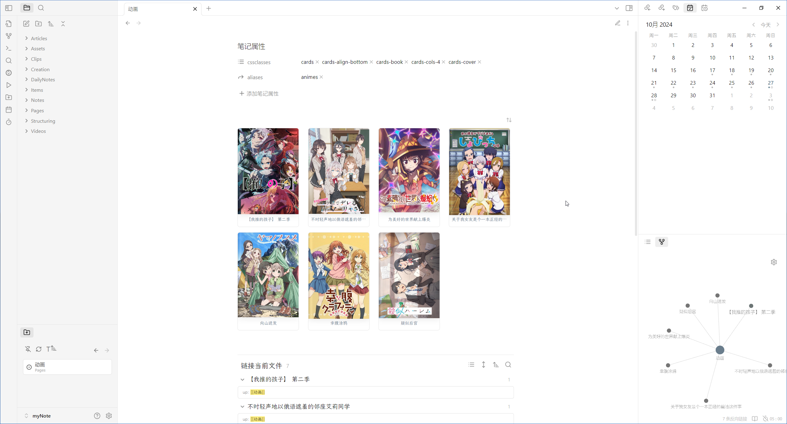

# Anime Parser

> [!WARNING]
> This is for my personal use and may contain serious bugs, please do not use it. If you really want to use it, please open an issue.

Parse a local directory to a anime.




> [!NOTE]  
> All parsed data comes from [Bangumi](https://bangumi.tv/).

## ⚡Usage

### Get the animes local resource that is stored correctly

This is a directory structure used for demonstration.

```
animes
├── Attack_on_Titan
│   ├── episode_1.mp4
│   ├── episode_2.mp4
│   └── ...
├── One_Piece
│   ├── episode_1.mp4
│   ├── episode_2.mp4
│   └── ...
└── Sword_Art_Online
    ├── episode_1.mp4
    ├── episode_2.mp4
    └── ...
```

**There shouldn't be any non-flat directory structure. Even different seasons of an anime.**

After parsing, resource files will be renamed to a fixed format (no setting to change this is provided), this is for [🖇️Unique and stable link](#️unique-and-stable-link).

```
animes
├── Attack_on_Titan
│   ├── 01.mp4
│   ├── 02.mp4
│   └── ...
├── One_Piece
│   ├── 01.mp4
│   ├── 02.mp4
│   └── ...
└── Sword_Art_Online
    ├── 01.mp4
    ├── 02.mp4
    └── ...
```

### Install && Set up the `media-extended` plugin

Create a custom protocols, select the `folder mapping` type, and map `animes` to the directory where anime local media files are stored.


Example: `anime -> file:///D:/Animes`。

### Import && Manage animes

Use the following code to create a dataviewJS block to create an animes bookshelf:

```js
// 下面是该Block的全部配置内容
const SourceFolder = "Animes"; // 数据来源是一个文件夹
const coverField = "cover"; // 想要作为封面展示的yaml 键名
const ItemProperties = {
	"封面": "$cover", // $cover会被替换为该Page的cover属性（以图片形式）
	"链接": (p) => p.file.link, // 使用箭头函数，定义项目的每一个属性
};
// 配置结束
const pages = dv.pages(`"${SourceFolder}"`).filter((p) => p[coverField]);

const generateCoverLink = (cover, filePath) =>
	`[](<${filePath}>)`;

Promise.all(
	pages.map(async (page) => {
		const coverUrl = page[coverField].startsWith("http")
			? page[coverField]
			: app.vault.adapter.getResourcePath(p[coverField]);
		return Object.values(ItemProperties).map((value) =>
			value === "$cover"
				? generateCoverLink(coverUrl, page.file.path)
				: value(page)
		);
	})
).then((tdata) => dv.table(Object.keys(ItemProperties), tdata));
```

Then, import animes. And you are done.

<details>
<summary>配置后具体视觉效果</summary>



</details>

## Propertys template

all available variables:

```
- {{cover}}
- {{id}}
- {{summary}}
- {{tags}}
- {{epNum}}
```

### Example Template

```
playlist: true
cover: {{cover}}
bangumiID: {{id}}
episodeNum: {{epNum}}
progress: 0
```

## 📜Helpful for Workflow

### [obsidian-banners](https://github.com/noatpad/obsidian-banners)

This plugin can be used to display anime cover as banner.

### [obsidian-frontmatter-viewmode](https://github.com/AlexDavies8/obsidian-frontmatter-viewmode)

This plugin can be used to set the default mode of a note representing an anime to read mode. In read mode, the page layout changes of the anime parser will take effect.

## 🖇️Unique and stable link

There are **some problems** with relying on local resource files to manage media files. What if one day I suddenly want to store my resource files in another path? What if I change computers and have the same resource files, but they cannot be recognized as the same item because of different file names? What if I share my library with others and they cannot correctly link notes to resource files?

The solution I thought of is to have a unique and stable link of a certain episode of a certain anime. This plugin runs on this concept, and in a broad sense, it is of course also a kind of **File over app**.

## 📺Syncing with bangumi

You can use the `Sync the progress of current anime to bangumi` command to sync your viewing progress to bangumi.

In the future, there will be more data that can be synced.

## ⚙️How episode parser works

Relevant code for how to sort the episodes by file name is written in [parser.ts](src/lib/parser.ts). This is the important part.

Rest of the relevant code is written in a [parseAnime](https://github.com/aoout/obsidian-anime-parser/blob/7905cc5e07278d2a36a1795d728a01e018aa7508/src/main.ts#L81C2-L183C3) function.

## 📱Mobile support?

It would be really great if the `media-extended` had mobile support. It could sync watching progress, episode notes, etc. Unfortunately, I don't know when that will be implemented.