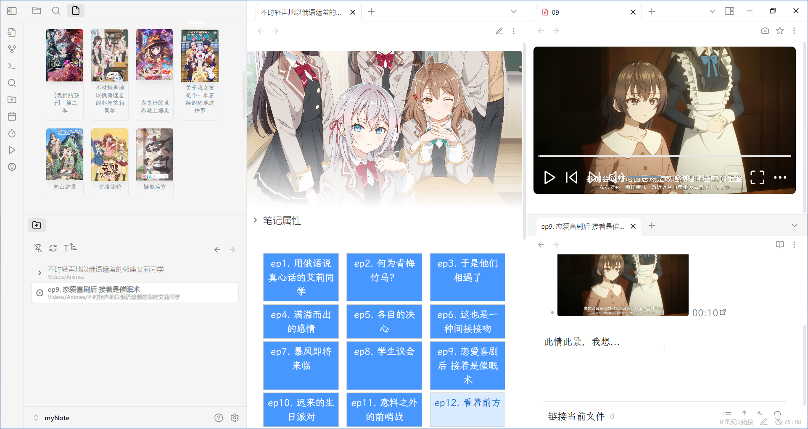

# Anime Parser

> [!CAUTION]
> This plugin is in the early testing stage. Be sure to back up everything before using it and be prepared for files to be damaged!

Parse a local directory to a anime.



## Usage

1. Fill in all settings, run `Anime Parser: Sync the animes library to obsidian` command, then there it was.
2. The name of the folder should be the name of the anime.
3. **WAENNING!** The episode parser will rename your video files！
4. Need to be used with [media-extended](https://github.com/PKM-er/media-extended) plugin.
5. The functions provided by this plugin are similar to [Jellyfin](https://jellyfin.org/).

### Propertys template

all available variables:

```
- {{cover}}
- {{summary}}
- {{tags}}
```